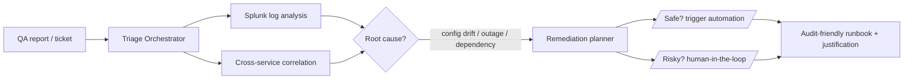

<!--
  ╔════════════════════════════════════════════════════════════════╗
  ║   Bhavya Mandaliya — AI Agent Engineer                          ║
  ║   Profile README. Copy to: AutoQAce/AutoQAce/README.md         ║
  ╚════════════════════════════════════════════════════════════════╝
-->

<div align="center">


<a href="https://www.typingsvgalternatives.example">

</a>

<br/>

[](https://www.linkedin.com/in/bhavya-mandaliya/)
[](https://github.com/AutoQAce)
[](https://github.com/AutoQAce?tab=followers)
[](https://github.com/AutoQAce)

</div>

---

<div align="center">

### `“Most agents work in a demo. Mine have to work at 2 a.m., under audit, when a dependency is down.”`

</div>

---

<table>
<tr>
<td width="50%" valign="top">

```python
class Bhavya:
    role       = "AI Agent Engineer"
    day_job    = "Automation Engineer @ UBS"
    experience = "10 yrs · trading & banking"
    domain     = "regulated financial services"
    builds     = "production agentic systems"
    not_this   = "notebook demos"

    @property
    def edge(self):
        return ("I know exactly where agents "
                "break in production — and I "
                "design around it from line 1.")
```

</td>
<td width="50%" valign="top">

**The 30-second version**

🏦 A decade automating complex **trading & banking** platforms.

🤖 Now building **multi-agent systems** that solve real operational problems at scale.

🧪 I treat **evals and failure-mode design** as the work — not the cleanup.

🎯 Heading toward **agent architect**: reliable, scalable, auditable systems, end-to-end.

📐 I measure my own skill honestly — *can I rebuild it cold, and can I defend the design choice?*

</td>
</tr>
</table>

---

## 🧭 What makes me different

Most agent projects ignore the constraints that define my world — **compliance, change control, access governance, operational risk, and auditability.** Ten years inside regulated trading platforms means I don't bolt those on after the demo; they're my **design inputs**. I build agents that ops teams will actually adopt and regulators can actually sign off on.

> **Anyone can make an LLM call a tool. The hard part is making it safe, observable, reversible, and explainable when it's wrong.** That's the part I'm good at.

---

## 🚀 Flagship Build — Environment Triage Agent  `active POC`

> A multi-agent system automating test-environment management across a **900+ component UAT trading platform.**



| | |
|---|---|
| 🔍 **Diagnoses** | Splunk log analysis + cross-service correlation to find probable root cause |
| 🛠️ **Acts (safely)** | Restart services, re-run provisioning, apply config fixes — with HITL gates on anything risky |
| 📋 **Proves it** | Emits an **audit-ready runbook** justifying every action, for governance |
| 📉 **Delivers** | Less triage time, less human toil, higher test reliability — controls intact |

---

## 🧩 Real Builds, Not Just Reading

I'm working through a **40-article, 11-phase agent-engineering curriculum** with a finance-capstone through-line. Every article becomes a self-contained build — notebooks, **evals**, learning journals, and **architecture decision records.** A sample of what's already shipped:

| 🏗️ Build | What it proves |
|---|---|
| **Multi-Agent Supervisor System** | `create_supervisor` + handoff tools · human-in-the-loop `interrupt()` · two-tier memory · LangSmith + openevals eval harness |
| **14 Pillars of Agentic Parallelism** | fan-out/fan-in at every layer — `Send` map-reduce · speculative execution · hedged/redundant calls · sharded scatter-gather · hybrid-search fusion · multi-hop RAG |
| **Contextual Engineering & Retrieval Eval** | scratchpad / context isolation / sub-agents · tool-retrieval metrics (nDCG · Recall · Precision · **Completeness@k**) · two-stage re-ranking |

<details>
<summary><b>📐 The part I'm proudest of — I measure capability, not activity</b></summary>

<br/>

Reading a notebook into existence proves almost nothing. So every pattern I learn is tracked on two honest axes:

- **Build axis** — *L0 encountered → L1 reproduce-with-reference → L2 rebuild-cold → L3 transfer to a novel problem.* A working notebook only earns L1. L2 means a blank file, from memory.
- **Architecture axis** — *can I defend choosing this pattern over a real alternative, under a real constraint?* Tracked in an ADR log, with **predicted vs. actual failure modes** filled in after the build.

This is exactly the discipline a regulated-finance architect is paid for: not "it ran," but **"I can rebuild it cold and justify why it's the right design."**

</details>

<details>
<summary><b>🧠 Agentic patterns I prototype & stress-test against financial-services failure modes</b></summary>

<br/>

`Reflection / self-eval` · `Secured tool use` · `ReAct` · `Plan → Execute → Verify` · `Blackboard coordination` · `Meta-controller / orchestrator` · `Short- & long-term memory`

Each is tested against what actually goes wrong in production: **noisy logs, partial outages, flaky dependencies, and sensitive-data handling.**

</details>

---

## 🛠️ Tech Stack

<div align="center">

**Agent Engineering & LLMs**


**Quality Engineering & Automation**


**Infra & DevOps · Languages**


</div>

---

## 📊 By the Numbers

<div align="center">


</div>

---

## 🤝 Let's Build the Hard Version

I want to talk if you're working on **AI agents in financial services**, **environment / infrastructure automation for trading & banking platforms**, or **production LLM evaluation & deployment.**

<div align="center">

[](https://www.linkedin.com/in/bhavya-mandaliya/)
[](https://github.com/AutoQAce)

<br/>

***Production constraints from line one — not retrofitted after the demo.***


</div>
